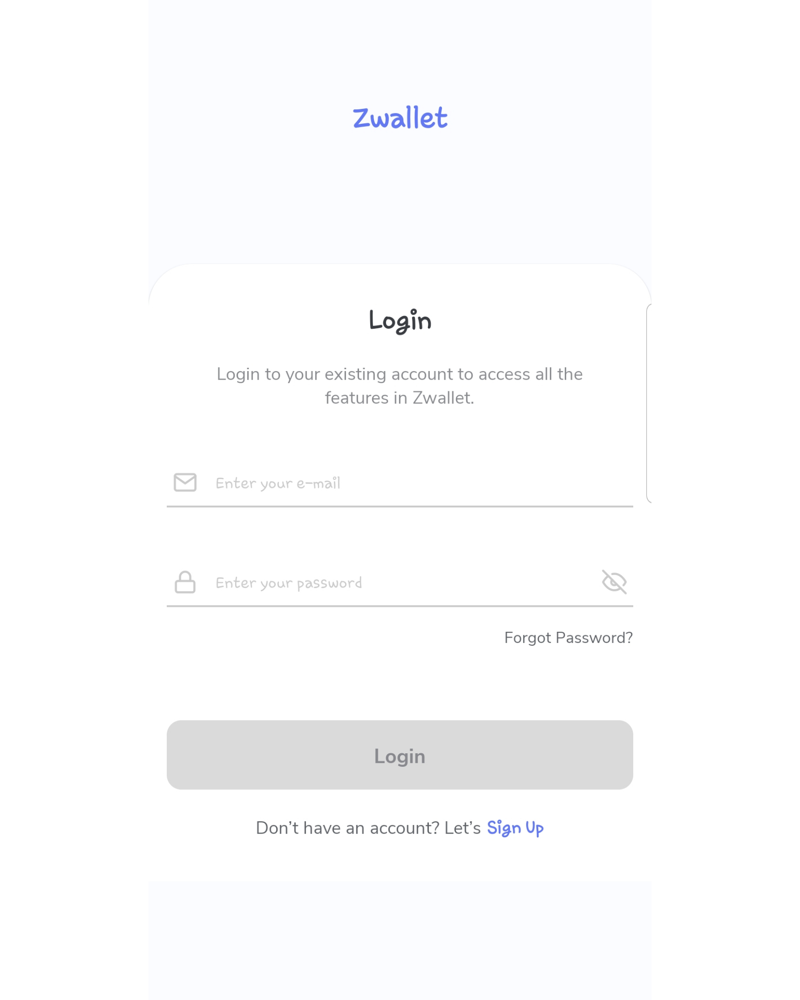
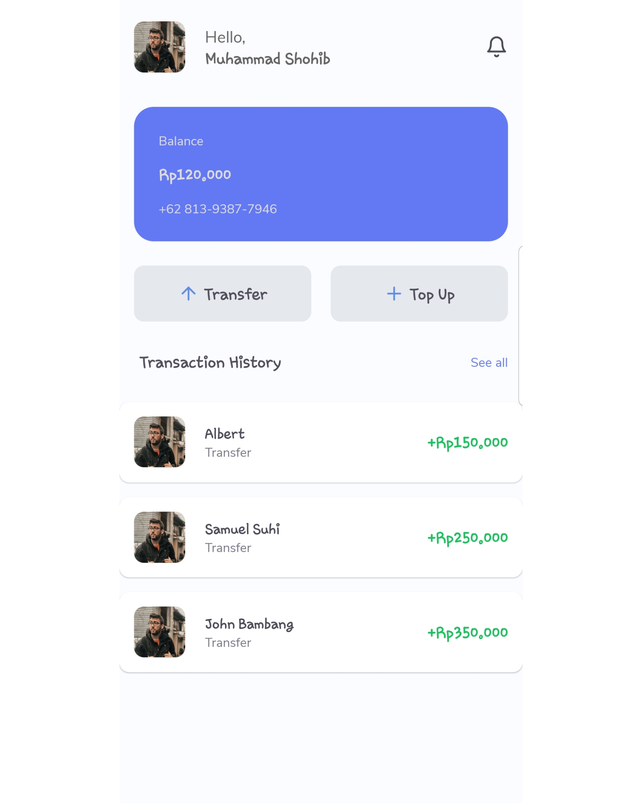
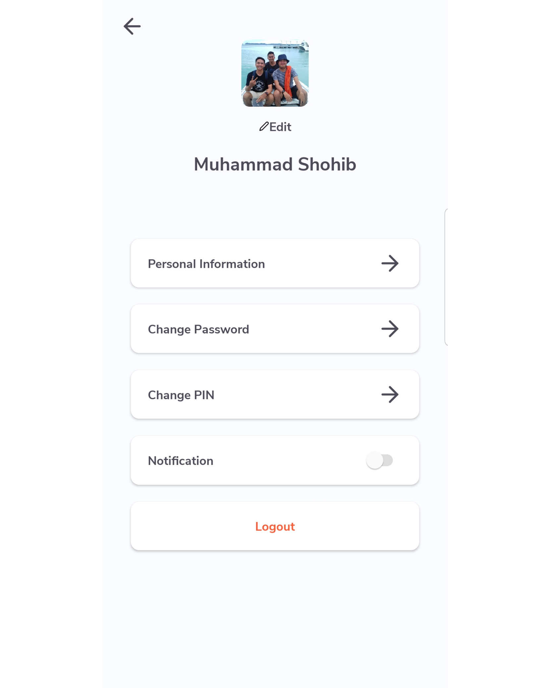
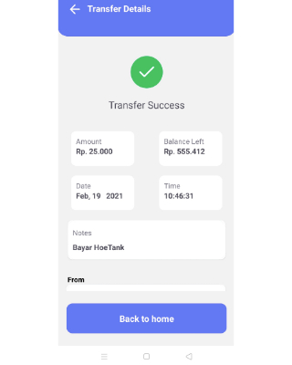
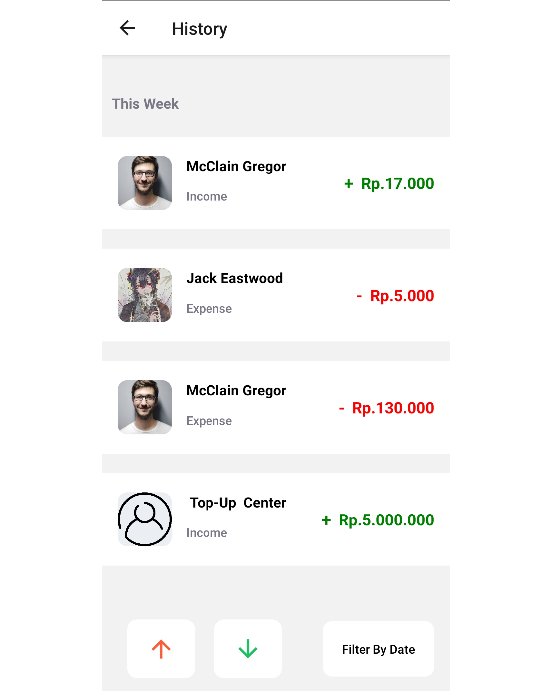
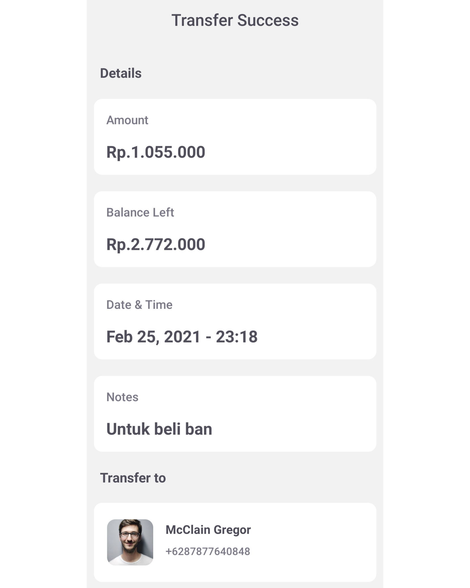

# Zwallet Mobile Application
<div align="center">
    
</div>

## Contents

- [Description](#description)
- [Features](#features)
- [Requirements](#requirements)
- [Installation](#installation)
- [ENV](#ENV)
- [Usage](#Usage)
- [Screenshoots](#screenshoots)
- [Demo](#demo)
- [Related Project](#related-project)
- [License](#license)

## Description

**Zwallet** Application that focussing in banking needs for all users in the world. Always updated and always following world trends.

## Features

- Balance
- Transfer Balance
- Top Up Balance
- History Transaction
- Contact
- Profile
- Edit Profile
- etc

### Requirements

- [`Node Js`](https://nodejs.org/en/)
- [`npm`](https://www.npmjs.com/get-npm)
- [`React Native`](https://reactnative.dev/)
- [`Zwallet REST API`](https://github.com/Quattuor/zwallet-api)

### Installation

1. Clone the repo
   ```sh
   git clone https://github.com/Quattuor/zwallet-app.git
   ```
2. Install NPM packages
   ```sh
   npm install
   ```
   This will install the dependencies inside `node_modules`
   
### ENV

Please create and make the changes in the .env file.

```bash
API_URL = "http://host_backend:port_backend"
```

Example :

```bash
API_URL = "http://localhost:4000"
```

### Usage

`npx react-native run-android` .

Connect your Android Emulator or Devices to runs the app in the development mode.

## Screenshoots

<table align="center">
  <tr>
    <td valign="center">
    <td valign="center">
    <td valign="center">
  </tr>
 </table>

<table align="center">
  <tr>
    <td valign="center">
    <td valign="center">
    <td valign="center">
  </tr>
</table>

## Demo

Zwallet build version.

[Download](https://drive.google.com/file/d/1j1Dh8h44u2UlVkXILNw_YjBtb4QIMirq/view?usp=sharing)

## Related Project

RESTful API for this application, clone this for development Zwallet.

<a href="https://github.com/Quattuor/zwallet-api">REST API</a>

## License

Distributed under the [MIT](https://github.com/Quattuor/zwallet-app/blob/main/LICENSE) License.
